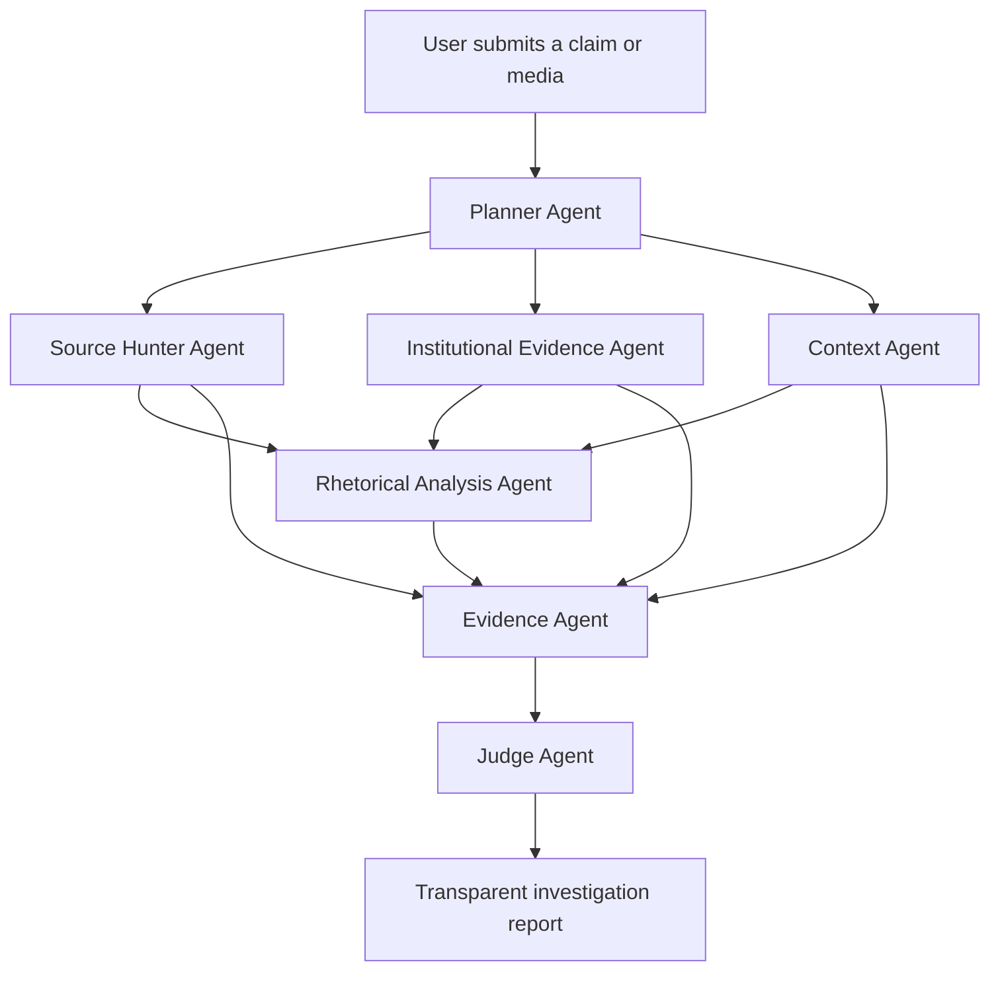

# Agent architecture

The agent system is deliberately visible in the demo. Each agent has one clear investigative question and a distinct output. For a short hackathon pitch, keep the main flow to seven agents or fewer.

## Investigation flow

## Visible agents

| # | Agent | Investigative question | Responsibility | Tools / skills | Demo visibility |
| --- | --- | --- | --- | --- | --- |
| 1 | Planner Agent | How should we investigate this? | Classifies the claim, extracts themes, and selects the agents that matter. | Planning, routing, task orchestration | Very high |
| 2 | Source Hunter Agent | Where did this information come from? | Finds the primary source, reposts, quotes, and initial chronology. | Web and news search | High |
| 3 | Institutional Evidence Agent | What do trusted institutions say? | Checks official and authoritative sources relevant to the subject and country. | Targeted search; APIs/MCPs later | Very high |
| 4 | Context Agent | What is needed to understand this correctly? | Adds historical, political, legal, technical, or scientific context; identifies exceptions and timelines. | Web search, encyclopaedias, specialist sources | High |
| 5 | Rhetorical Analysis Agent | How is this content trying to persuade me? | Analyses rhetoric, omissions, certainty, framing, emotional language, and potential manipulation. | LLM reasoning, NLP, argument analysis | Very high |
| 6 | Evidence Agent | What evidence exists? | Merges findings, detects contradictions, separates supported from unverified claims, and builds the evidence graph. | Results fusion and evidence modelling | Very high |
| 7 | Judge Agent | What is the conclusion? | Produces the report, verdict, confidence, uncertainty, and the evidence that could change the conclusion. It performs no additional research. | LLM synthesis | Very high |

## Agent details

### Planner Agent

The Planner is the orchestrator. It should make its routing decision visible. For example, a claim about a French government policy launches the Source Hunter, Institutional Evidence, and Context agents, while skipping unrelated scientific or financial specialists.

### Source Hunter Agent

Expected output:

- likely first appearance;
- original publisher and source type;
- repost and citation chain;
- chronology of relevant publications;
- whether a quote, image, or statement appears out of context.

This data powers the **Origin Map**, a visual propagation chain such as Telegram → anonymous social account → Reddit → influencer → media → politician.

### Institutional Evidence Agent

This is the evolved, scalable name for the original “France Data Agent.” Its responsibility is to find official evidence, regardless of jurisdiction.

Initial French sources:

- Légifrance
- INSEE
- data.gouv.fr
- Vie-publique
- Assemblée nationale
- Sénat

Future sources:

- EUR-Lex
- U.S. SEC
- Companies House
- WHO
- NASA
- World Bank

### Context Agent

This agent answers: “What is missing for a fair understanding?” For example, it can distinguish a draft law from a promulgated law, identify exceptions, explain a legal deadline, or clarify what a study actually claims.

### Rhetorical Analysis Agent

This agent assesses presentation rather than factual truth. Its key question is:

> Even if this information is true, is it being presented honestly?

It should identify:

- emotional intensity: fear, anger, indignation, urgency, sensationalism;
- reasoning issues: false dilemma, hasty generalisation, cherry-picking, appeal to emotion, straw man, ad hominem, slippery slope, appeal to authority;
- mismatch between the certainty asserted and the evidence available;
- important omissions;
- framing: how the same facts can be narrated to push a particular interpretation.

An optional **manipulation-risk score** can summarise these signals. It is not a truth score.

### Evidence Agent

The Evidence Agent constructs an explicit graph:

- claim;
- evidence that supports it;
- evidence that contradicts it;
- claims that remain unverified;
- source quality and independence.

### Judge Agent

The Judge converts the structured evidence into a concise, cited investigation report. Its signature output is **“What would change my mind?”**: the missing evidence that would increase, lower, or reverse confidence.

## Optional agents

| Agent | Question | Value |
| --- | --- | --- |
| Follow-up Agent | What happens if the situation evolves? | Periodically searches for new evidence, recalculates confidence, and alerts users when a conclusion changes. |
| Image / Video Analysis Agent | Is this media authentic and in context? | OCR, visual analysis, origin search, and out-of-context media detection. |
| Scientific Agent | What does the research literature say? | Searches PubMed, HAL, and Crossref for health and science claims. |
| Perspective Agent | Why does this matter from different disciplines? | Presents factual context from journalism, science, law, economics, and history without turning it into opinion. |
