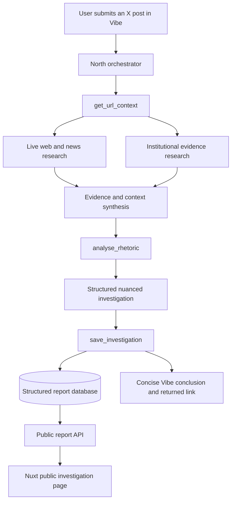

# Agent architecture

North keeps orchestration visible in Mistral Vibe while separating live investigation from durable report rendering.

## End-to-end flow

## Visible investigative roles

The roles are an understandable presentation of one orchestrated workflow, not a promise that every role is a separate deployed service.

| Role | Investigative question | Responsibility | Demo visibility |
| --- | --- | --- | --- |
| Planner | How should this post be investigated? | Extracts claims and selects relevant research. | High |
| Source Hunter | Where did it originate? | Finds originals, related publications, and chronology. | High |
| Institutional Evidence | What do authoritative institutions say? | Searches jurisdiction- and subject-specific official evidence. | High |
| Context | What is needed for a fair interpretation? | Identifies scope, dates, exceptions, baselines, and methodology. | High |
| Rhetorical Analysis | How is the message framed? | Assesses wording, omissions, emotion, and certainty without inferring intent. | High |
| Evidence | What supports, contradicts, or remains unknown? | Reconciles findings, source quality, independence, and citations. | High |
| Judge | What cautious conclusion follows? | Synthesises the structured report and identifies what could change it. | High |

Short statuses such as “Vérification auprès de sources institutionnelles” make these responsibilities visible. They must not reveal intermediate conclusions as final.

## Runtime responsibilities

- **North orchestrator Skill:** validates input, announces statuses, orders tool calls, enforces evidence and safety policy, builds the complete save payload, saves it, and formats the final three-bullet maximum response.
- **Read/research MCP tools:** `get_url_context`, `search_web_news`, `search_institutional_evidence`, and `analyse_rhetoric` retrieve or analyse live material. They do not persist the report.
- **Persistence MCP tool:** `save_investigation` validates the complete domain payload and atomically creates the report aggregate. It returns only the committed public identifier and URL.
- **Database:** stores the report and all structured related records, including source citations.
- **Nuxt API and page:** load the saved aggregate by public UUID and render the detailed investigation.
- **Mistral Vibe:** shows live statuses and the concise final conclusion. It does not render the long-form report.

## Evidence boundaries

The system prefers primary and institutional sources, treats repeated coverage with a shared origin as dependent, and makes contradictions and gaps explicit. A Community Note is a research lead, not an automatic refutation. If reliable external evidence is unavailable, the conclusion is **Preuves insuffisantes** rather than an invented answer.
