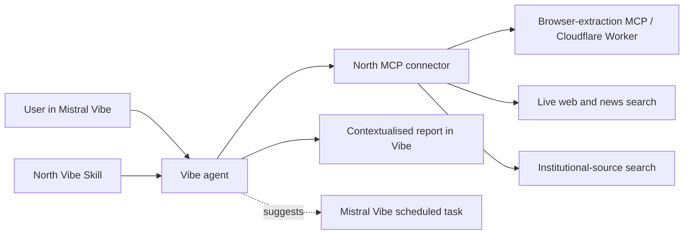

# Engineering handoff

This document records the decisions confirmed during the hackathon discovery interview. It is the reference for developers joining after the initial build.

## Goal and non-goal

**Goal:** in Mistral Vibe, accept an X post URL and return a live, cited investigation that adds factual context and rhetorical context around the post.

**Non-goal:** determine or proclaim “the truth.” North must make uncertainty, competing perspectives, evidence quality, and missing information explicit.

## Confirmed constraints

| Area | Decision |
| --- | --- |
| Working name | North |
| Team | Two engineers |
| Deadline | A few hours; prioritise an end-to-end live experience |
| Event criterion | Showcase Mistral Vibe through ambitious, creative, impactful use of agents, Skills, MCPs, and/or scheduled tasks |
| Supported MVP input | An X post URL |
| Accepted URL forms | `x.com/.../status/...` URLs, including tracking query parameters; normalise to the canonical URL before retrieval |
| Demo language | French for the Vibe Skill, tool outputs, and final report |
| Data mode | Fully live; do not use mock fallback data |
| Orchestrator | Mistral Vibe agent |
| Orchestration instruction | A Vibe Skill tells the agent how to plan, call MCP tools, assess evidence, and present the final report |
| Integration model | North capabilities are exposed as MCP connector tools to Vibe |
| Web stack | Nuxt, AI SDK, Nuxt MCP Toolkit, Cloudflare Workers/AI, and browser automation |
| Follow-up | The Skill suggests a Mistral Vibe scheduled task; North does not operate a scheduler or notification system |
| Persistence | No persistence in the MVP. A future website may store tool results in a database to visualise investigations. |
| Product direction after event | Undecided |

## System boundary

### Responsibilities

- **Vibe Skill:** defines the investigation playbook, routes work to tools, requires citations and uncertainty, and suggests a follow-up task when appropriate.
- **Vibe agent:** orchestrates tool calls, evaluates their outputs, and writes the report.
- **North MCP connector:** exposes the investigation capabilities Vibe needs.
- **Browser-extraction MCP:** exposes `get_url_context`, a generically named URL-context capability designed to support multiple web sources over time. In the MVP, its browser worker supports X post URLs only and returns X-specific structured metadata through browser automation.
- **Nuxt application (future companion UI):** may visualise saved investigation traces and evidence graphs. It is not required for the Vibe-first MVP.

## Proposed MCP surface

Tool names are provisional. Build the highest-value path first; the tool surface may grow if time permits.

| Priority | Tool | Input | Required output |
| --- | --- | --- | --- |
| P0 | `get_url_context` | Public HTTP(S) URL; X post URLs only in the MVP | Rendered page context plus source-specific structured metadata. For the current X implementation: canonical URL, author, publication time, post text, engagement metrics when available, Community Note URL when detected, video URLs, rendered Markdown context, and any available video transcription or transcription error. The generic name reserves this interface for future URL types. |
| P0 | `search_web_news` | Query, date range, optional preferred domains | Source title, publisher, URL, publication time, excerpt, relevance, and retrieval timestamp |
| P0 | `search_institutional_evidence` | Claim, subject, jurisdiction | Official-source citations, supporting or contradicting excerpts, source URL, and retrieval timestamp |
| P0 | `analyse_rhetoric` | Original text plus evidence summary | Emotional framing, certainty-versus-evidence mismatch, omissions, fallacies, framing, and cautious explanation |
| P1 | `build_origin_timeline` | Extracted post and discovered sources | Chronological events, source relationships, confidence, and unknown links |
| P1 | `build_evidence_graph` | Structured findings from other tools | Supports, contradicts, unverified items, source quality, and independence notes |
| P1 | `get_investigation_status` | Correlation ID | Tool progress and explicit errors for a future visualisation UI |

The extractor must reject unsupported links with a clear French error message. It should remove tracking query parameters before storing or displaying a canonical post URL.

## Evidence policy

1. Prefer primary sources whenever available.
2. For French public-policy claims, search Légifrance, INSEE, data.gouv.fr, Vie-publique, Assemblée nationale, and Sénat.
3. Expand by subject and jurisdiction to sources such as EUR-Lex, WHO, NASA, World Bank, U.S. SEC, and Companies House.
4. Use reputable journalism, including *Le Monde*, as contextual secondary reporting, not as a substitute for a primary source.
5. Always return clickable citations and distinguish primary, institutional, and secondary sources.
6. Do not treat repeated coverage as independent confirmation. Record when sources share a common origin.
7. Disclose that the submitted URL and extracted post content may be sent to the browser, search, AI, and other third-party services used to perform the investigation.

## Report contract

Every completed Vibe response should follow this structure:

1. **Claim received**: quote or accurately paraphrase the X post.
2. **Contextualised conclusion**: a nuanced label such as Highly supported, Weak evidence, Conflicting reports, Too early to conclude, Likely satire, or Original source unavailable.
3. **Confidence and why**: evidence-based explanation, never an unexplained percentage.
4. **Evidence for and against**: separate supported, contradicted, and unverified points.
5. **Origin and timeline**: the post’s known source chain; explicitly flag gaps.
6. **Missing context**: legal scope, dates, exceptions, methodology, baseline, or other qualifiers that change interpretation.
7. **Rhetorical analysis**: framing, omissions, emotional language, and certainty calibration. This is not a truth score.
8. **Citations**: source links with labels.
9. **What would change this conclusion**: concrete evidence that would shift confidence.
10. **Follow-up suggestion**: when the claim is developing or uncertain, invite the user to create a Vibe scheduled task.

## Safety and quality rules

- Never present North as an authority that decides truth.
- Do not infer facts beyond the retrieved evidence or fabricate citations.
- Make source limitations, disagreement, and failures visible.
- Avoid amplifying unverified allegations, especially about identifiable people. Describe them as unverified and seek primary evidence.
- For political, legal, health, and scientific claims, distinguish reporting from evidence and include scope, timing, and uncertainty.
- Rhetorical analysis must critique the wording and framing, not attack the speaker or infer intent.
- If extraction, search, or citation retrieval fails, return a helpful error state identifying what failed and what the user can provide next.
- If the post is available but reliable external evidence is not, return a French **preuves insuffisantes** report. It may provide carefully labelled rhetorical analysis, but must not imply a factual conclusion.

## Media extraction note

The primary demo post is labelled as a video by X and the surrounding page text refers to it as a video. However, the captured post content currently provides only a JPEG preview image and a `00:00` media indicator, not a playable video stream or video-asset URL. Treat the post as **video-indicated, with no retrievable video asset** unless the extractor obtains an explicit media URL during a live run.

The extractor should keep these states distinct in its output:

- `media_type_hint`: the platform's indicated media type, such as `video`;
- `media_preview_url`: a thumbnail or still image, when available;
- `media_asset_url`: a playable or downloadable asset URL, only when actually retrieved;
- `media_extraction_status`: whether the actual media asset was retrieved, unavailable, or failed to extract.

## Primary demo acceptance criteria

Use this live X post: <https://x.com/BFMTV/status/2070421512050364493?s=20>.

The post quotes French Minister Monique Barbut expressing concern that widespread air-conditioning is only an emergency measure and will not prevent forest fires or animal deaths. X displays a Community Note that adds an important public-health perspective: air conditioning can prevent premature heat-related deaths, particularly where heat risk is high.

The demo succeeds only if it:

- accepts and extracts the X URL live;
- visibly shows Vibe calling North’s MCP tools;
- identifies that climate adaptation and heat-health protection are related but distinct considerations;
- presents the Community Note and external sources as context, not an automatic refutation;
- cites live sources and separates sourced evidence from interpretation;
- avoids an absolute verdict about the minister’s statement;
- surfaces a clear error state if a live dependency fails;
- suggests a Vibe scheduled task only if the investigation identifies a developing question worth revisiting.

## Deferred work

- A database for tool-call traces, investigation history, and source results.
- A Nuxt companion website for an Origin Map, evidence graph, and investigation visualisation.
- Media, video, PDF, and plain-text inputs.
- Image/video authenticity and reverse-origin analysis.
- Autonomous follow-up execution outside Mistral Vibe.
- Dedicated scientific and perspective agents.
