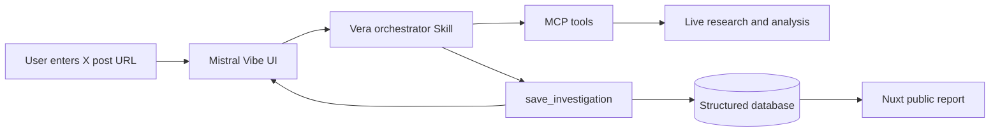

# 3. What we built in Mistral Vibe, and how it connects

**Time:** 0:45–1:05, while the investigation is synthesised

## Slide content

### Mistral Vibe is the live investigative interface

In Vibe, we built:

- an input flow for a supported X post URL;
- visible, non-conclusive investigation statuses;
- a concise French result with one decisive source;
- one link to the complete public report.

### A Skill is the playbook. Vera is the investigation system.

| Layer | Role |
| --- | --- |
| Mistral Vibe Skill | Orchestrates the sequence, evidence policy, statuses, and concise response. |
| MCP tools | Retrieve live post context, web/news evidence, institutional evidence, and rhetoric analysis. |
| `save_investigation` | Validates and atomically persists the structured investigation and citations. |
| Nuxt report | Publishes a durable, shareable evidence report from the database. |

## Speaker notes

“We use Mistral Vibe as the live interface. The user pastes an X post URL, sees short investigation statuses as Vera works, and receives a concise French conclusion with one decisive source and one report link.

Because this happens in Mistral Vibe, the experience is accessible without technical expertise. Users do not need to configure tools, understand research workflows, or write specialised prompts. They simply bring the claim they want to understand.

Behind that interface, the Vera Skill is the investigative playbook. It decides the sequence, evidence policy, tool calls, statuses, and final response shape.

But a Skill alone is ephemeral and conversation-bound. Vera needs live retrieval to investigate the current world, structured persistence to preserve citations and uncertainty, and a public report that can be inspected independently of the Vibe conversation.

The MCP tools bring in live post context, web and institutional evidence, and rhetoric analysis. `save_investigation` validates the complete structured payload, stores it atomically, and returns the public report URL. The Nuxt application then renders that stored investigation.

The Skill orchestrates the work. Vera makes the work reliable, durable, and auditable.”

## Short version

“A Skill can reason over a conversation. Vera turns that reasoning into a real investigation: live sources in, structured evidence saved, and a public report out.”

## Transition

“Now let’s return to the live investigation.”
